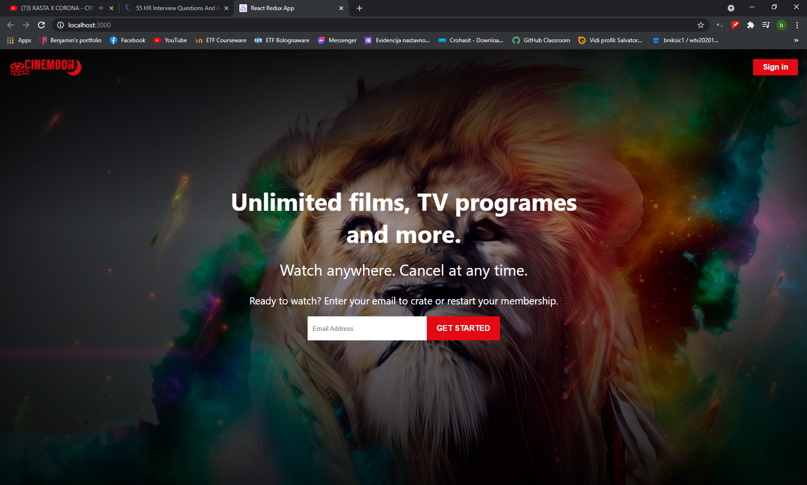
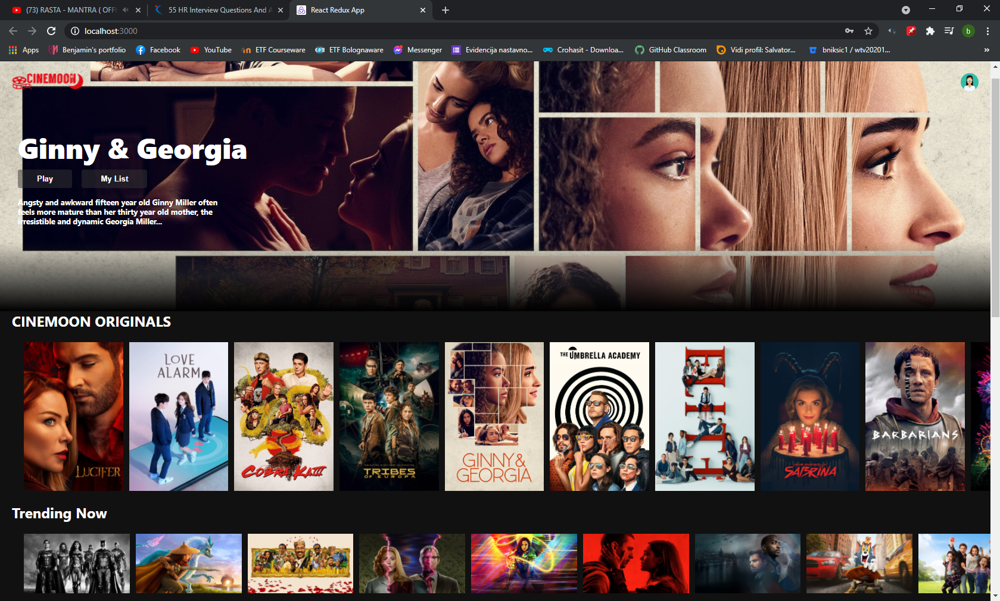
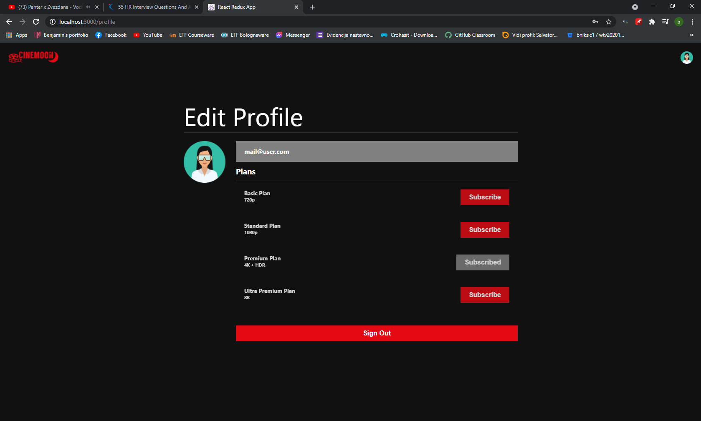

<!-- PROJECT LOGO -->
 

  

  <h3 align="center">Cinemoon</h3>

<!-- ABOUT THE PROJECT -->
## About The Project

Project inspired by Netflix official webpage.

Main focus of this project was learning and practising technologies for both backend and frontend.

Backend contains model with entities connected to Postgres database with annotations that Spring Boot provides.

Nicely structured movie content and categories taken from Netflix API provides beautiful and simple design. 

Frontend uses react functional components with hooks. Every frontend action is asynchrone and doesn't run reloading page.

Application has spring boot security support with backend JWT authentication. 
 

### Built With

This section is list of languages and frameworks that project uses:
* [Java]()
* [Spring Boot]()
    * [Spring Boot Web]()
    * [Web Security]()
    * [JWT Auth]()
    * [JPA Repository - Hibernate]()
    * [PostgreSQL JDBC]()
    * [Lombok]()
* [ReactJS]()
    * [Redux]()
    * [Bootstrap]()
* [HTML]()
* [CSS]()
* [JavaScript]()
* [PostgreSQL]()
